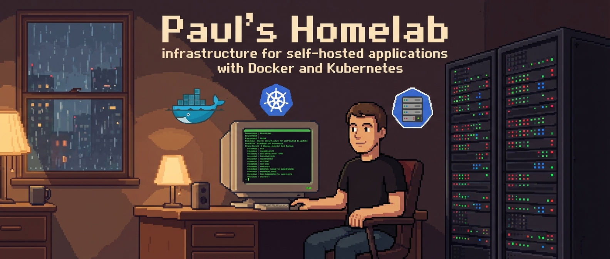
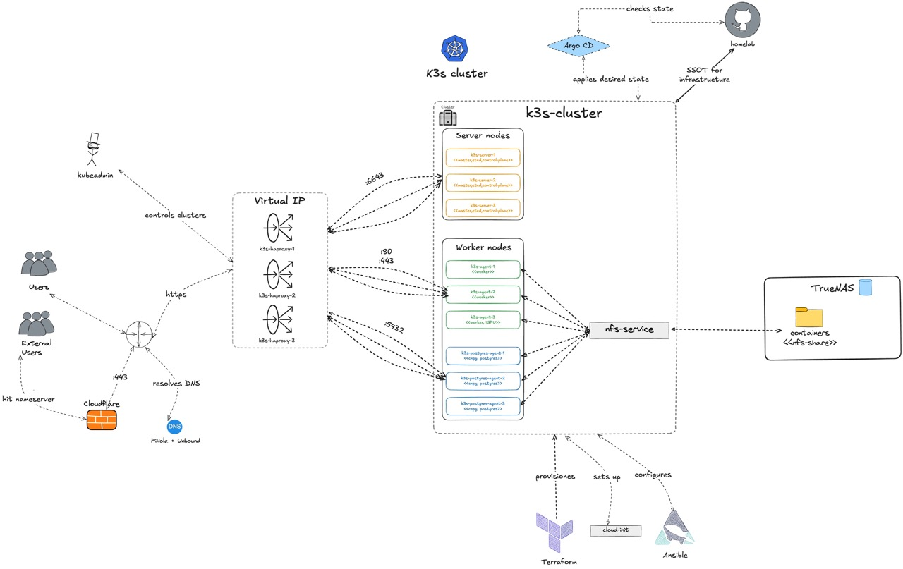

# Homelab




> **home•lab**
> */ˈhōmˌlæb/* • *noun*
>
> 1. A personal infrastructure environment used to simulate enterprise-scale distributed systems. *Without the risk of getting fired.*
> 2. The art of over-engineering solutions to simple problems for the sake of learning

This repository contains the **Infrastructure as Code (IaC)** and **GitOps**
configurations for my homelab.

It serves as a production-grade playground to implement enterprise patterns,
simulated at home, on my own tiny little server.

Trying things, experimenting with technologies and surely: troubleshooting.
Better to break things here, then in a high-traffic production environment.

Focussing on High Availability, Stateless Machines and Disaster Recovery.

## Doing It In Public, But Why?

* **Forced Security:** Transparency eliminates shortcuts. Publishing this code forces me to handle secrets correctly rather than relying on security by obscurity or lazy hacks.
* **Knowledge Sharing:** It serves as a real-world reference for other "homelabers", helping them building such infrastructure.
* **Proof of Work:** This repository acts as a living record of my engineering journey, technical decisions, and how I solve infrastructure problems.

---

## 🎯 High-Level Overview (The "Why")

The infrastructure is built on the philosopy of the **12-Factor App** principles and **Cloud-Native** standards. Demonstrating how to manage complex distributed systems (effectively).

* **Immutable Infrastructure:** Servers are provisioned via `Terraform` and bootstrapped via `Ansible`.
* **GitOps Source of Truth:** The cluster state is reconciled automatically from this repository using FluxCD. No `kubectl apply -f` allowed.
* **Security First:** All secrets are encrypted via `SOPS` and `age`. No sensitive data is committed in plain text.
* **Business Continuity:** Critical databases (PostgreSQL and Redis) run in HA clusters with automatic failover and daily backups to offsite object storage (Cloudflare R2).



---

## 🏗 Architecture

### Hardware Layer (Proxmox)

Proxmox serves as the host for the virtual machines. Its own infrastructure is bootstrapped via `Terraform`.

* **3x Server nodes:** Etcd HA, Kubernetes control plane.
* **3x Worker nodes:** Application workloads.
* **3x Postgres Worker nodes:** Dedicated ndoes for cloudnative-pg (PostgreSQL) workloads.
* **3x Load Balancers:** HAProxy + Keepalived (VRRP) providing a Virtual IP for the Kubernetes API.

### Orchestration (K3s)

A High-Availability K3s cluster. Network connectivity is handled via **Tailscale** (Mesh VPN) and **Cloudflare Tunnels** (Ingress), eliminating the need for open inbound ports on the router. Mine doesn't even allow me to do so.

### The Stack

| Domain | Technology | Implementation Details |
| :--- | :--- | :--- |
| **GitOps** | FluxCD | Automated reconciliation, Helm releases. |
| **Dependencies** | Renovate| Automated PR creation for outdated versions. |
| **Ingress** | Traefik + Cloudflare | Cloudflare Tunnels for external access; internal HTTPS middleware. |
| **Database** | CloudNativePG | HA Clusters, WAL archiving to S3 (R2), auto-failover. |
| **Storage** | NFS | NFS (`nfs-subdir-external-provisioner`) for bulk media; Local Path for DBs. |
| **Secrets** | SOPS + Age | Encrypted in Git, decrypted inside the cluster via Kustomize controller. |
| **Observability** | LGTM Stack | Loki, Grafana, Promtail, Beszel, Gatus (Health Dashboard). |
| **Provisioning** | Terraform + Ansible | Infrastructure provisioning. |

---

## 🔧 Engineering Highlights

### 1. Database Reliability (CNPG)

Unlike standard StatefulSets, this cluster uses the **CloudNativePG** operator.

* **Architecture:** Primary + 2 Replicas.
* **Storage:** Local Path storage on dedicated nodes, replicating themselves.
* **Backups:** Continuous WAL archiving to Cloudflare R2 to allow for Point-In-Time Recovery (PITR).

### 2. Networking Resilience

* **API Server:** A virtual IP (VIP) floats between 3 HAProxy nodes using Keepalived.
* **Ingress:** Cloudflare Tunnels (cloudflared) and `Traefik`.

### 3. Secret Management

Secrets are managed via **(Mozilla) SOPS**.

* Encrypted YAML is committed.
* Flux decrypts manifests in-cluster using the private key stored in a K8s Secret.

## 🚀 Bootstrapping

1. **Provision VMs:**

    ```bash
    cd terraform/cluster-provisioning
    terraform apply
    ```

2. **Bootstrap Kubernetes:**

    ```bash
    cd ansible
    ansible-playbook playbooks/cluster-provisioning/init-cluster.yaml
    ```

3. **Inject Secrets:**

    ```bash
    # Upload Age key to the cluster for Flux decryption
    ./apply-sops-age.sh
    ```
