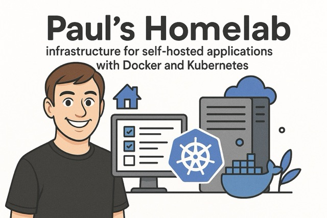

# Homelab

This repository contains the configuration and documentation for my personal homelab infrastructure.
It covers the complete stack from VM provisioning through system configuration to application orchestration using Kubernetes and Docker.

The entire setup follows GitOps principles, with Argo CD implementing continuous reconciliation loops to ensure the cluster maintains its desired state.

## Why Make This Public?

- It forces security practices through transparency (proper secret management, secure configurations)
- It serves as a reference implementation that may help others building their own homelab environments
- It documents my DevOps journey and highlights my technical decisions

# Kubernetes cluster

High-Availability K3s Kubernetes cluster with:

- 3× Server nodes (control plane) with etcd HA
- 3× Agent nodes (general workloads), including one with iGPU passthrough
- 3× PostgreSQL specialized agent nodes
- 3× HAProxy nodes with Keepalived for load balancing and high availability

## High-level overview

## Key Design Principles

- **High Availability**: Redundant components ensure service continuity
- **Workload Separation**: Control plane workloads isolated from application workloads
- **Specialized Nodes**: Nodes with specific hardware capabilities for targeted workloads
- **GitOps Workflow**: Infrastructure defined as code, managed through Git

## Technology Stack

- **Cluster**: K3s with HA embedded etcd
- **Networking**: HAProxy with Keepalived for VRRP 
- **Storage**: NFS for persistent volume claims
- **Provisioning**: Terraform and Ansible
- **Configuration Management**: ArgoCD, GitOps
- **DNS & Service Discovery**: Cloudflare, PiHole
